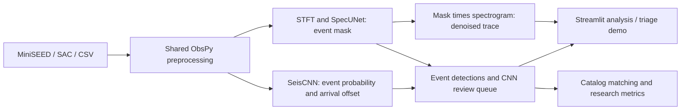

# APSIS project review — 2026-09-15

## Purpose and architecture

APSIS studies detection, arrival estimation, denoising, and bandwidth-aware
triage of single-channel Moon and Mars seismic recordings under scarce labels.
Its two detectors serve different roles. It is a research prototype and demo;
the on-lander behavior is a simulation, not a validated flight deployment.



| Component | Responsibility |
|---|---|
| `planetseis/preprocessing.py` | Read waveforms; demean, detrend, bandpass, resample |
| `planetseis/model.py`, `detect.py` | SeisCNN and window-level detection / uncertainty |
| `planetseis/spectral.py`, `unet.py`, `detect_spec.py` | Fixed STFT grid, mask prediction, detection and denoising |
| `planetseis/injection.py` | Catalog-selected event templates injected into noise with synthetic mask targets |
| `planetseis/data.py`, `windows.py`, `dataset.py` | Data selection, historical splits, training windows |
| `planetseis/evaluate.py`, `scripts/` | Scoring, training, baselines, ablations and reproduction |
| `app/streamlit_app.py` | Analysis, denoising, triage simulation and results presentation |
| `benchmark/`, `models/`, `results/` | Frozen manifests, shipped checkpoints and experiment evidence |

The existing Python, ObsPy, PyTorch, Streamlit, NumPy/SciPy and Plotly stack
fits the purpose. This improvement pass adds no framework or model architecture.

## Highest-priority finding: lunar split contamination

The original splitter groups by filename. The NASA packet can provide the same
station-day waveform under multiple event IDs, each carrying a different pick.
The frozen lunar manifest has 75 filenames but only 70 acquisition stems.
Five acquisition spans repeat; two cross the train/test boundary:

| Acquisition | Train event ID | Test event ID | Samples in each waveform |
|---|---|---|---|
| S12 MHZ, 1972-07-17 00:00 | `evid00068` | `evid00067` | 572,399 |
| S12 MHZ, 1974-07-06 00:00 | `evid00150` | `evid00151` | 572,411 |

For both pairs, local cached arrays are exactly equal, sample rates match, and
SHA256 hashes match. Raw MiniSEED inspection also confirmed matching start/end
times and sample counts. Thus **2 of 19 lunar test waveforms also occur in
training**. Separate picks mean event energy can also be mislabeled as noise
when only one filename's catalog row is considered.

The impact on F1 cannot be quantified without rebuilding and retraining.
Existing lunar scores, uncertainty comparisons, and seed-level statistical
tests describe the historical split; they are not independent-test evidence.
Reproducing those scores exactly would not resolve the contamination.

### Repeat the audit

```powershell
# Filename candidates; works without the raw packet or cache.
.venv\Scripts\python scripts\audit_splits.py

# Confirm candidates against local cached waveforms; writes portable evidence.
.venv\Scripts\python scripts\audit_splits.py --cache data/cache/lunar/continuous --output results/split_integrity_audit.json
```

Exit **1** means overlap was found; exit **2** means the audit could not run.
The report distinguishes unverified candidates from confirmed identical arrays.
It checks timestamped filename groups, not every possible partial overlap.
The absence of a candidate is not proof that a dataset is independent.

### Corrective research work

1. Group by station, channel, and actual acquisition intervals; merge overlapping
   spans and union their event picks before making windows or selecting noise.
2. Create a separately versioned benchmark and cache so historical experiments
   remain reproducible. Include assertions against cross-split overlap.
3. Retrain both detector families and rerun relevant baselines and seeds. Choose
   thresholds and duration gates on validation only.
4. Publish corrected metrics and their uncertainty, explicitly separating them
   from the historical scores. Adding model capacity cannot fix this problem.

This pass preserves frozen manifests, caches, model weights, and result files.
It adds an audit and disclosures; it does not claim to have repaired the
benchmark or produced corrected model scores.

**Status 2026-09-23 — steps 1–4 done for the lunar benchmark.**
`benchmark/lunar_grouped_v1.json` groups by channel + UTC interval + waveform
identity, unions picks, and recovers `evid00029` (38/11/18 groups, 42/11/23
events, zero cross-split overlap). Both detectors were retrained from scratch
over five seeds with validation-only operating points locked before test
access. Test F1: SeisCNN 0.531 ± 0.031, SpecUNet 0.408 ± 0.043 (Welch
p = 0.0012); matched filter 0.200; STA/LTA 0.168. See
`results/lunar_grouped_v1_seed_summary.json`. Seed-42 secondary analyses
(Nakamura FP cross-check, MC uncertainty, SNR strata, PR sweep) were also
rerun on the corrected split, and the lunar demo now uses the corrected
seed-42 checkpoints. Still historical-split only: screening ablation, denoise
chain, archive scan and Mars (listed in `tasks/RESEARCH_HANDOFF.md`).

## Improvements in this pass

- Make analysis an explicit action, with bundled preprocessed demos available
  without downloading the full packet. Keep completed results tied to their
  submitted source and settings.
- Run denoising and triage inference only when requested.
- Start analysis with the published operating points: SeisCNN threshold 0.99
  lunar / 0.50 Mars; SpecUNet threshold 0.30 with 600 s lunar / 240 s Mars
  minimum duration. Changed settings and MC results are exploratory.
  (Superseded 2026-09-23 for lunar: corrected seed-42 models at 0.97 and
  0.25 / 430 s.)
- Isolate upload or missing-resource failures so other app views remain usable.
- Validate waveform shape, finite amplitudes, sampling rates, CSV timing, and
  single-channel inputs. Preserve the clean-data preprocessing sequence.
- Describe SpecUNet outputs as mask scores and describe its catalog-derived
  template supervision accurately. Correct the stale statistical-parity claim.
- Correct expanded Mars arrival refinement: stored MAE is 33.93 s before and
  34.20 s after refinement, not the older 24.5 → 18.7 s claim.
- Add focused regression tests, app tests, and split-audit evidence.

## Further priorities within the same purpose and stack

**First:** repair and revalidate the data protocol above. The stored archive
scan also shows poor continuous-archive tradeoffs; curated-demo success should
not be presented as operational catalog-extension performance.

**Then:** review boundary handling in both inference paths under a new benchmark
version. SeisCNN currently leaves a trailing partial hop unscanned; SpecUNet
requires a full 8192-sample input window. Model-boundary changes can change
published metrics and need dedicated regression and benchmark validation.
The current denoiser also leaves its final 64 samples at zero because the last
dropped STFT frame is excluded from overlap reconstruction; this boundary needs
explicit treatment in future denoising metrics and output interpretation.

**After that:** evaluate uncertainty calibration and useful recall at a stated
false-alarm rate. The existing results show that SpecUNet MC uncertainty does
not have the same triage interpretation as SeisCNN uncertainty.

## Verification

Baseline before changes: **44 tests passed**; final suite: **115 tests passed**.
Real-checkpoint app checks passed for both detectors on bundled lunar and Mars
traces, including Mars denoising and retaining results after control changes.
The split audit confirms two cross-split duplicate waveform pairs and
intentionally returns exit 1. Details are recorded in `tasks/todo.md`.
