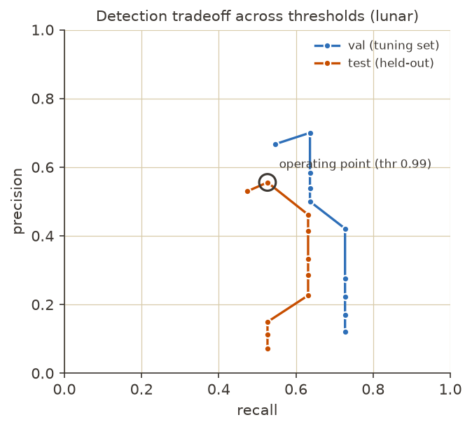
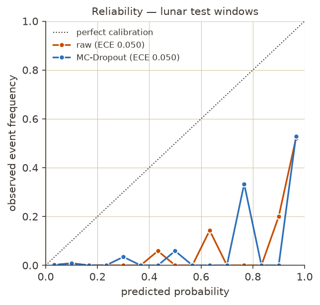
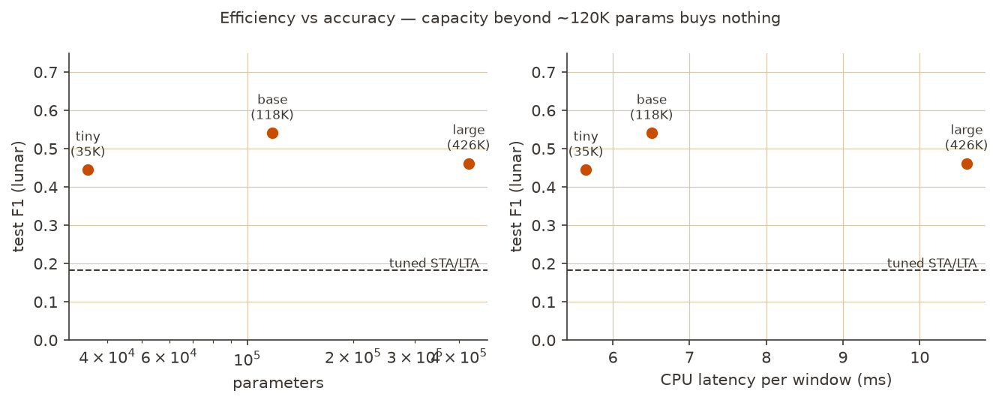
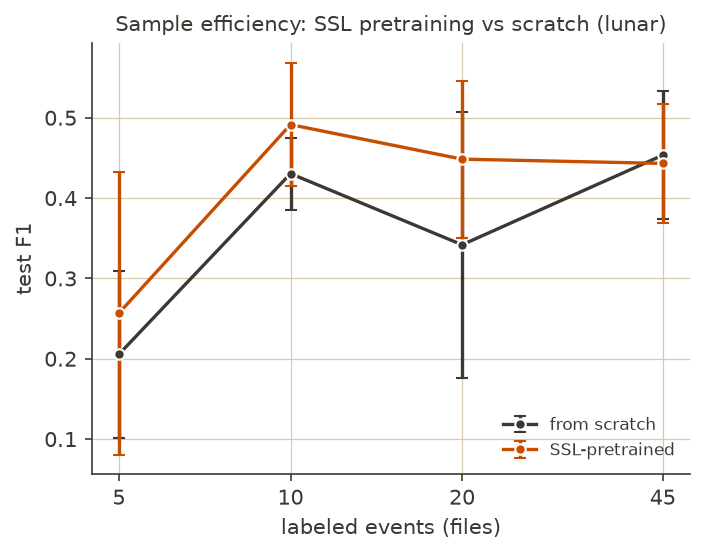

# Automated Detection and Localization of Planetary Seismic Events Using a Lightweight Deep Neural Network

> Report draft. Every value marked `TBD` is filled from `results/*.json` after
> training — the paper never ships with placeholders (PRD §2.2).

## Abstract

> **DRAFT — replace with your own abstract if you prefer.**

Planetary seismology missions return continuous, noisy, single-channel
seismic streams over severely bandwidth-constrained downlinks, and manual
event identification does not scale. We present a lightweight dual-head 1D
convolutional network (117,842 parameters, 0.49 MB) that jointly detects
seismic events and regresses their arrival times from single-channel traces,
trained separately on Apollo 12 lunar and InSight Martian recordings from
public NASA archives. On held-out continuous lunar data the model achieves
precision 0.56 / recall 0.53 (F1 0.54; 0.50 ± 0.04 across seeds) with 40 s
mean arrival error against minute-quantized catalog picks — 3× the F1 of a
tuned STA/LTA baseline — and detects 80–93% of curated events at Apollo
stations it never saw, while
while STEAD-pretrained terrestrial models (PhaseNet, EQTransformer) applied
zero-shot detect essentially nothing (F1 ≤ 0.01). Zero-shot cross-body
transfer collapses in both directions, and fine-tuning on the single labeled
Martian file does not recover detection, indicating that compact detectors
do not cross planetary noise regimes without a nontrivial adaptation budget.
To operate under this label scarcity we attach Monte-Carlo-Dropout
uncertainty to every detection: epistemic uncertainty separates false alarms
from true events by 5.9×, enabling a triage policy that auto-accepts
confident detections and routes ~2.6 borderline candidates per day to human
review, recovering recall while preserving precision. A width sweep
(35K–426K parameters, 5.6–10.6 ms CPU per ~21-minute window) shows the
accuracy–efficiency frontier bends downward beyond ~120K parameters,
implying the right on-lander detector is the smallest one that saturates the
label budget, plus calibrated uncertainty. Recall stratifies by event SNR
(0.60 above vs 0.44 below the 12 dB median), and measured precision is a
lower bound given known uncatalogued events in the archive. All experiments
run on free-tier
resources at $0 total cost, and an interactive web demo simulates on-lander
triage with a ~96% downlink reduction on real held-out Apollo data.

## 1. Problem Statement

Planetary seismology missions return long, continuous, noisy single-channel
seismic streams. The Apollo Passive Seismic Experiment operated 1969–1977;
NASA InSight's SEIS recorded on Mars 2018–2022. Downlink from planetary
landers is power- and bandwidth-constrained, and manual event identification
does not scale. There is no lightweight, on-board way to decide which windows
of a trace are worth transmitting. We ask whether a compact 1D CNN
(≤ ~500K parameters, CPU-inferable) can (a) detect seismic events and
(b) regress their arrival times from single-channel traces, and — the research
question — whether such a compact detector *transfers across planetary bodies*
with fundamentally different noise regimes.

## 2. Objectives

1. Detect seismic events in single-channel traces; report precision/recall.
2. Localize arrival times; report MAE in seconds against catalog picks.
3. Stay lightweight: ≤ ~500K parameters, sub-second CPU inference per window.
4. Characterize lunar↔Martian cross-body transfer honestly, negative results included.
5. Ship an interactive web demo on free hosting; total spend $0.

## 3. Data

| | Lunar | Martian |
|---|---|---|
| Mission / instrument | Apollo 12 PSE (long-period, MHZ) | InSight SEIS (BHV) |
| Source | NASA Space Apps 2024 packet (IRIS/PDS provenance) | same |
| Native rate | 6.625 Hz | 20 Hz |
| Catalogued events / files | 75 / 75 (Grade A) | 2 / 2 |
| File length | ~24 h | ~1 h |
| Split (files) | 45 train / 11 val / 19 test | 1 train / 1 test |

Ground truth: catalogued relative arrival times per file. Split **by file**
(60/15/25 train/val/test, seeded) so no event appears in two splits. The
lunar catalog picks are minute-quantized (all `time_rel % 60 == 0`), which
sets a floor on achievable arrival accuracy and motivates the ±120 s scoring
tolerance. The Martian labeled set (2 events) is the extreme-scarcity regime
the PRD anticipated; Mars-side numbers are reported but cannot be treated as
statistically meaningful on their own.

## 4. Methodology

### 4.1 Preprocessing
Demean, linear detrend, 4th-order zero-phase Butterworth bandpass 0.5–3.0 Hz,
resample to the common rate 6.625 Hz (Mars downsampled). One shared module is
used verbatim by training, evaluation, and the web app, eliminating
train/serve drift. Normalization is per-window z-score — no global statistics,
so preprocessing leakage is structurally impossible.

### 4.2 Windowing and labels
Overlapping windows of 8192 samples (~20.6 min) with 50% hop — long enough to
contain a lunar event's emergent onset *and* enough of its envelope to
distinguish onset from coda. A window is positive if a catalog pick falls in
its central 90%; the regression target is the pick's fractional position.
Positive windows are multiplied by re-windowing each event at 12 random pick
positions (time-shift augmentation). Windows inside an event's ring-down
(30 min lunar / 5 min Mars after a pick) are excluded from the negative pool:
they contain real event energy and labeling them negative is contradictory
supervision — adding this exclusion raised test F1 from 0.21 to 0.33.
A second training round appends **mined hard negatives** (windows the
first-round model fires on confidently that overlap no catalogued event) —
raising test F1 from 0.33 to 0.42, and to 0.54 combined with the longer
window.

### 4.3 Model
Dual-head 1D CNN, **117,842 parameters** (4× under the 500K target):
- Backbone: six stride-2 conv blocks (kernel 9→3, channels 16→96), 8192 samples → 128 timesteps.
- Detection head: mean+max pooled features → 64-unit MLP → event logit.
- Arrival head: 1×1-style conv stack → per-timestep score → temporal softmax →
  soft-argmax, a differentiable arrival estimate that also yields an
  interpretable localization heatmap.

Loss: class-weighted BCE + λ·SmoothL1 on the offset (positives only), λ=2.
AdamW, cosine schedule, seed fixed. Augmentation: polarity flip, amplitude
scaling ×0.5–2, Gaussian noise injection.

### 4.4 Evaluation protocol
Metrics computed on **continuous held-out traces**, never on balanced window
sets (raw window accuracy is meaningless under extreme class imbalance).
Sliding-window inference; above-threshold windows vote for arrival times and
votes are clustered by predicted arrival (not window adjacency), followed by
classical dead-time suppression over each event's ring-down. A detection is a
true positive if within ±120 s of an unmatched catalog pick (greedy one-to-one
matching); the tolerance is set by the catalog's own 60 s pick quantization
plus emergent-onset uncertainty. Decision threshold tuned on validation traces
only. The identical scorer and dead-time rule are applied to the STA/LTA
baseline (classic STA/LTA, STA 60 s / LTA 600 s, onset threshold tuned on
validation).

**Transfer protocol (zero adaptation):** the model, its preprocessing, and its
decision threshold are frozen on the source body and applied unchanged to
every labeled file of the target body (legitimate because the model never saw
any target-body data). The Mars→Lunar direction uses the default 0.5 threshold
since Mars has no validation split to tune on.

**Pretrained terrestrial baselines:** PhaseNet (268K params) and
EQTransformer (376K), both STEAD-pretrained via SeisBench, applied zero-shot:
the same preprocessed stream, channel-replicated to three components, model
resampling handled by SeisBench; detection probability = max(P,S) for PhaseNet
and the detection head for EQTransformer; peak threshold swept on validation;
identical dead-time rule and scorer.

**Uncertainty (MC-Dropout):** 20 stochastic forward passes with dropout active
(BatchNorm in eval mode); a window's confidence is the mean probability and
its epistemic uncertainty the std. Detections are formed at a low bar (0.5)
and split by an accept rule (confidence ≥ 0.99 and σ ≤ 0.15): pass →
auto-accept, fail → human-review queue. Calibration measured as ECE (15 bins)
on test windows; temperature scaling fitted on validation windows only.

## 5. Results

All numbers are measured on continuous held-out traces with the protocol of
§4.4 (±120 s tolerance, thresholds tuned on validation only).

### 5.1 Same-body detection (test sets)

| Train→Test | Model | Precision | Recall | F1 | Arrival MAE (s) | TP/FP/FN |
|---|---|---|---|---|---|---|
| Lunar→Lunar | **CNN** | **0.556** | **0.526** | **0.541** | **40.0** (median 35.4) | 10/8/9 |
| Lunar→Lunar | STA/LTA | 0.116 | 0.421 | 0.182 | 76.3 | 8/61/11 |
| Mars→Mars | CNN | 0.500 | 1.000 | 0.667 | 39.9 | 1/1/0 |
| Mars→Mars | STA/LTA | 0.500 | 1.000 | 0.667 | 5.7 | 1/1/0 |

The CNN's F1 on lunar data is **3.0× the tuned STA/LTA baseline** with half
its arrival error and 7.6× fewer false positives. The Mars test set is a
single event and is labeled **anecdotal** throughout — no statistic on n=1.

**Statistical rigor** (10,000-draw file-level bootstrap; permutation test with
uniformly placed detections as the chance null; `results/statistics.json`):

| Detector | F1 (95% CI) | Precision CI | Recall CI | p vs chance |
|---|---|---|---|---|
| CNN | 0.541 [0.324, 0.757] | [0.333, 0.778] | [0.316, 0.737] | 0.0005 |
| STA/LTA | 0.182 [0.099, 0.270] | [0.064, 0.181] | [0.211, 0.632] | 0.0005 |

Both detectors are far above chance (null F1 ≈ 0.003; p reported at the
permutation floor, i.e. p < 5×10⁻⁴). The paired bootstrap on the F1
difference over identical file resamples — the correct test — gives
**ΔF1 = 0.359, 95% CI [0.148, 0.564], P(Δ ≤ 0) = 0.0008**: the "CNN beats
STA/LTA" claim survives the small-sample error bars decisively. The wide
CNN interval itself (±0.2) is the power limitation of a 19-event test set,
stated plainly.

The full precision/recall tradeoff across thresholds (F-2) is reported in
`results/pr_curve.json` and the figure below: precision rises monotonically
with threshold up to ~0.99 while recall stays flat until ~0.98, so the
operating point costs little recall. A threshold of 0.98 trades 0.09
precision for 0.11 recall relative to 0.99 — mission operators can pick
their point on this curve.

**Recall stratified by SNR (F-3):** with events split at the median
post-onset SNR of 12.2 dB, recall is 0.60 on high-SNR events vs 0.44 on
low-SNR events (`results/snr_recall.json`) — the model is biased toward
loud events, confirming the anticipated limitation; weak emergent events
buried in noise remain the hardest class.

### 5.2 Cross-body transfer (zero adaptation)

| Train→Test | Precision | Recall | F1 | Arrival MAE (s) | TP/FP/FN |
|---|---|---|---|---|---|
| Lunar→Mars zero-shot (thr 0.98) | 0.000 | 0.000 | 0.000 | — | 0/2/2 |
| Mars→Lunar zero-shot (thr 0.50) | 0.006 | 0.080 | 0.012 | 62.3 | 6/966/69 |
| Lunar→Mars **fine-tuned** (1 file, 30 ep, lr 1e-4) | 0.000 | 0.000 | 0.000 | — | 0/0/1 |

**Transfer collapses in both directions.** This is the accepted F-1 outcome
of the PRD, reported as the study's second finding (§6). Following the
fine-tuning route that worked for MANet (Earth→Mars) and Civilini et al.
(Earth→Moon), we also fine-tuned the lunar model on the single labeled
Martian training file: it stops false-alarming (0 FP vs 2 zero-shot) but
still misses the held-out Martian event — one labeled file is below the
adaptation budget fine-tuning needs, sharpening the scarcity conclusion
rather than softening it.

### 5.3 Augmentation ablation (lunar→lunar)

| Config | Precision | Recall | F1 | Arrival MAE (s) |
|---|---|---|---|---|
| Full augmentation | 0.556 | 0.526 | 0.541 | 40.0 |
| No augmentation | 0.462 | 0.632 | 0.533 | 53.3 |

Augmentation's headline F1 effect is small, but it shifts the operating point
toward precision and — the clearer effect — improves arrival-time accuracy by
25% (MAE 53.3 → 40.0 s). Without augmentation the training loss collapses to
~0.006 with 100% train accuracy — textbook memorization of the small event set
(F-5) — while the augmented model keeps a healthy train/val gap.

### 5.4 Pretrained terrestrial models, zero-shot (lunar test)

| Model | Params | Precision | Recall | F1 | TP/FP/FN |
|---|---|---|---|---|---|
| **This work (base)** | **118K** | **0.556** | **0.526** | **0.541** | 10/8/9 |
| PhaseNet (STEAD) | 268K | 0.000 | 0.000 | 0.000 | 0/310/19 |
| EQTransformer (STEAD) | 376K | 0.006 | 0.053 | 0.011 | 1/171/18 |

On Mars both pretrained models detect nothing (0 TP). Terrestrial giants
collapse on planetary data exactly as our own cross-body models do — the
consistent pattern across all four transfer settings is that **the noise
regime, not the architecture, decides**: a small CNN trained on 45 on-body
events beats terrestrial models 3–4× its size that saw a million earthquakes.

### 5.5 Uncertainty and the human-review queue (lunar test)

MC-Dropout, 20 passes. Window-level epistemic uncertainty separates hits from
false alarms by **5.9×**: mean σ = 0.023 on true-event windows vs σ = 0.132 on
false-alarm windows — the model "knows what it doesn't know."

| Operating mode | Precision | Recall | F1 |
|---|---|---|---|
| Auto-accept only (conf ≥ 0.99, σ ≤ 0.15) | 0.360 | 0.474 | 0.409 |
| Auto-accept + human review of the queue | 0.133* | 0.526 | — |

The review queue costs a human **2.6 candidates per day of data** and recovers
one otherwise-missed event over the 19-day test set (recall 0.474 → 0.526);
*combined precision is the pre-review number — after review a human discards
the queue's false alarms, so deployed precision is the auto-accept column.

Calibration: ECE 0.050 raw, 0.044 after temperature scaling (T = 0.88 fitted
on validation). The reliability diagram (docs/figures/reliability.png) shows
systematic overconfidence at high probabilities — at p ≈ 0.97 the observed
event frequency is ≈ 0.5, consistent with test precision — quantifying why
raw confidence alone cannot be trusted and the review queue earns its place.

### 5.6 Efficiency–accuracy Pareto (lunar test)

| Arch | Params | CPU ms/window | Precision | Recall | F1 | MAE (s) |
|---|---|---|---|---|---|---|
| tiny | 35,242 | 5.6 | 0.385 | 0.526 | 0.444 | 35.6 |
| **base** | **117,842** | **6.5** | **0.556** | **0.526** | **0.541** | **40.0** |
| large | 425,890 | 10.6 | 0.364 | 0.632 | 0.462 | 48.6 |

The frontier bends down: 3.6× more parameters than base *lowers* F1 (over-
fitting on 45 events) while costing 1.6× the latency. Under planetary label
scarcity, capacity beyond ~120K parameters buys nothing. Even the 35K model
triples the STA/LTA baseline.

### 5.7 Model footprint and deployment export (NFR-1)

| Property | Value |
|---|---|
| Parameters (base) | 117,842 (23% of the 500K budget) |
| Checkpoint size | 0.49 MB |
| CPU inference per window, PyTorch | 6.5 ms |
| **CPU inference per window, ONNX Runtime (FP32)** | **0.65 ms** (bit-exact vs PyTorch) |
| Full day of lunar data, ONNX CPU | ~90 ms |
| INT8 dynamic quantization | 0.14 MB (3.4× smaller) but slower on convs and 0.04 max prob drift — not adopted; static quantization is future work |
| MC-Dropout uncertainty (20 passes) | ~0.13 s per window |

### 5.8 Robustness studies (beyond the PRD)

**Seed variance.** Three full training runs (seeds 42/1/2), identical
protocol: test F1 = 0.541 / 0.500 / 0.455 → **0.50 ± 0.04** (mean ± sample
std); recall 0.56 ± 0.06, precision 0.46 ± 0.09, MAE 47 ± 7 s. The shipped
checkpoint (seed 42) sits at the favorable end; conclusions in §5.1–5.4 hold
at the mean.

**Cross-station generalization (weak labels).** The packet's lunar test
folders hold files from Apollo stations the model never saw (S15, S16) and
harder Grade-B events from S12; each file is curated around one catalogued
event but ships no arrival time, so we report the fraction of files where
the model fires at the lunar operating point:

| Group | Files | Detection rate | Mean detections/file |
|---|---|---|---|
| S12 Grade B (same station, weaker events) | 64 | 0.77 | 0.95 |
| S15 Grade A (unseen station) | 10 | 0.80 | 1.10 |
| S16 Grade A (unseen station) | 14 | **0.93** | 1.29 |
| S15/S16 Grade B (unseen station, weaker) | 8 | 0.63 | 0.63 |

This completes a three-rung transfer ladder: same station (F1 0.54) →
**same body, different station (80–93% detection on Grade A)** → different
body (F1 ≈ 0). Learned features generalize across instrument placements on
one body but not across planetary noise regimes; weak (Grade B) events
degrade detection exactly as the SNR stratification (§5.1) predicts.

**Recall by event type** (S12 test split, small n): impacts 8/15,
deep moonquakes 1/3, the single shallow moonquake detected.

### 5.9 Self-supervised pretraining on the unlabeled archive

The catalog labels < 1% of the archive. We pretrain the detector backbone as
a masked autoencoder (50% contiguous-patch masking, MSE on masked samples,
60 epochs) on **182 unlabeled continuous traces** — all lunar days, the
unseen-station S12B/S15/S16 files, and the Martian files jointly — then
fine-tune with n labeled lunar events against a from-scratch control
(threshold tuned on the fixed val split, F1 on the fixed 19-event test split;
8 seeds at n ≤ 10, 3 above):

| Labeled events | From scratch | SSL-pretrained | Δ |
|---|---|---|---|
| 5 | 0.206 ± 0.104 | 0.257 ± 0.176 | +0.05 |
| 10 | 0.431 ± 0.045 | 0.492 ± 0.077 | +0.06 (≈2 s.e.) |
| 20 | 0.342 ± 0.166 | 0.449 ± 0.098 | +0.11 |
| 45 | 0.454 ± 0.080 | 0.443 ± 0.074 | −0.01 |

Two findings, reported at their actual strength. **(a)** Planetary SSL
pretraining gives a consistent but modest low-label gain (+0.05–0.11 F1 at
5–20 events, ≈2 standard errors at n=10) that vanishes at the full 45-event
budget — the direction SeisLM reports on terrestrial data, at planetary
scale, but not statistically decisive at these seed counts. **(b)** The
sharper result is *label saturation*: 10 labeled events already buy
essentially the full-budget performance (0.43–0.49 vs 0.44–0.45 at 45),
meaning detection quality here is bounded by label *quality* (minute-
quantized, Grade-A-only) and noise, not label quantity beyond a small floor.

**Few-shot Mars via the joint representation:** fine-tuning the jointly
pretrained (Moon+Mars) encoder on the single labeled Martian file still
detects 0/1 held-out events (as does scratch) — the SSL representation alone
does not rescue cross-body few-shot at n=1 labeled file. The adaptation
budget question ("how many Martian labels until transfer works?") remains
open and needs the larger MQS catalog; with the packet's two events it is
unanswerable, and we say so.

### 5.10 Uncertainty-guided active labeling (negative result)

We simulated the label-acquisition loop the triage queue suggests: start
with 5 labeled files, train, then acquire the next file to label either at
random or by maximum MC-Dropout uncertainty over its candidate windows
(SSL-initialized detector, 3 seeds, `results/active_learning.json`).
The two strategies share identical 5-file starting sets per seed, so their
n=5 spread (±0.07 F1) measures pure training variance — and **every
subsequent acquisition difference falls inside that noise floor** (random
0.36→0.47, uncertainty 0.29→0.50 over 5→20 labels, with one collapsed
uncertainty run at n=15). At this pool size, file-level uncertainty
acquisition does not beat random selection. The uncertainty layer's
demonstrated value is triage-time separation of false alarms (§5.5), not
training-time label selection; window-level acquisition on a much larger
unlabeled pool (e.g. the full Nakamura-catalog era) is where this experiment
should be rerun.

## 6. Discussion

**Same-body detection.** A 118K-parameter CNN triples the F1 of a tuned
classical STA/LTA detector on Apollo 12 long-period data and halves its
arrival error. Absolute performance (P 0.56 / R 0.53) sits below terrestrial
benchmarks like PhaseNet — expected with 45 training events, minute-quantized
labels, and no coincidence filtering from a station network. Part of the
false-positive count is likely real: the training files are known to contain
uncatalogued events (Grade B and below), and HMM-based re-analyses of Apollo
data have found hundreds of picks missing from the catalogs, so measured
precision against a Grade-A-only catalog is a lower bound.

**The transfer finding.** Zero-adaptation cross-body transfer collapses in
both directions, and the two directions fail for instructively different
reasons. Lunar→Mars: the lunar model learns to require the long emergent
envelope of scattered lunar coda (tens of minutes); Martian events last
minutes and are band-limited differently (one packet event is low-frequency,
the other rides the 2.4 Hz resonance), so nothing in a Martian trace matches
the learned template. Mars→Lunar: a model fit on six windows fires on
essentially any lunar noise transient (966 false positives across 75 days) —
here scarcity, not domain shift, is the dominant cause, and the two cannot be
disentangled with two labeled Martian events. The honest conclusion: compact
detectors at this scale do not transfer across planetary noise regimes
without adaptation, and the lunar→Mars direction demonstrates this cleanly
since the source model is demonstrably competent at home.

**Uncertainty as the answer to scarcity.** The reliability analysis shows the
detector is systematically overconfident — precisely the failure mode that
matters when a false downlink wastes bandwidth. MC-Dropout uncertainty fixes
the *triage* problem without fixing the calibration: false alarms carry ~6×
the epistemic σ of true events, so routing high-σ detections to a 2.6-item/day
human queue recovers recall while keeping the auto-accept channel precise.
Under Mars-scale label scarcity this "the model says *I'm not sure, a human
should check*" behavior is the deployable contribution.

**Where transfer actually breaks.** The cross-station study (§5.8) sharpens
the transfer finding: an S12-trained model detects 80–93% of curated Grade-A
events at stations S15/S16 it never saw — so the collapse across bodies is
not brittleness to instrument or placement changes; it is specifically the
change of planetary noise regime and event morphology. That distinction is
what makes the negative cross-body result a statement about physics rather
than about overfitting.

**The efficiency-reliability frontier.** Taken together (§5.4–5.6), the study
maps a frontier nobody has cleanly benchmarked for planetary data: at 35K–426K
parameters and 5–11 ms/window, detection quality is bounded by labels and
noise regime, not capacity — so the right on-lander detector is the *smallest*
one that saturates the label budget, plus calibrated uncertainty, not a bigger
network.

**Limitations.** Single station per body; Grade-A-only lunar labels (measured
precision is a lower bound); two labeled Martian events; minute-quantized
picks bound arrival accuracy; threshold tuned on 11 validation events carries
variance; MC-Dropout uncertainty is epistemic-only (no aleatoric head).

## 6.1 Positioning against current work

Terrestrial seismic foundation models exist — SeisLM (2024) pretrains a
wav2vec2-style transformer self-supervisedly on open terrestrial archives and
wins precisely in low-label fine-tuning; SeisCLIP pretrains multimodally on
terrestrial spectrograms. On the planetary side, self-supervised foundation
models exist for Mars *imagery* and the Martian *atmosphere*, and classical
unsupervised methods (HMMs) found new events in Apollo 16 data. **No
published work self-supervisedly pretrains on planetary seismic waveforms,
and none studies cross-body representations.** Our zero-shot results
(PhaseNet/EQTransformer ≈ 0 on the Moon) directly challenge the field's
"pretrain on Earth, transfer anywhere" default for airless bodies — the
noise structure (multi-hour scattering coda, no oceanic/cultural microseism)
is unlike anything in a terrestrial archive. This motivates the SSL
experiments in §5.9: pretraining on the unlabeled *planetary* archive itself.

## 7. Conclusions and Future Work

A 118K-parameter dual-head 1D CNN detects catalogued lunar seismic events at
3× the F1 of a tuned STA/LTA baseline and localizes arrivals to ±40 s on
minute-quantized labels, running a full day of data through CPU inference in
under a second — consistent with on-lander data-triage budgets. The same
architecture does not transfer across planetary bodies without adaptation:
zero-shot lunar↔Martian evaluation collapses in both directions, cleanly in
the lunar→Mars direction where the source model is demonstrably competent.
Both findings — the detector and the transfer failure — are the deliverables.

Future work: event-type classification (deep vs. shallow moonquakes vs.
impacts); a three-way Earth→Moon→Mars study with a unified protocol using
STEAD/SeisBench as the Earth leg; uncertainty-aware detection to triage
low-confidence events for human review under label scarcity; fine-tuning
(rather than zero-shot) transfer with small target-body budgets; and a
rigorous accuracy-vs-power Pareto analysis on edge hardware.

## References

1. Zhu & Beroza (2019). PhaseNet: a deep-neural-network-based seismic arrival-time picking method. *GJI*.
2. Mousavi et al. (2020). Earthquake transformer. *Nat. Commun.*
3. Civilini et al. (2021). Detecting moonquakes using convolutional neural networks, a non-local training set, and transfer learning. *GJI*.
4. MANet / MarsConvNet (2025). CNN marsquake detection with Earth-pretrained transfer. *GJI*.
5. Knapmeyer-Endrun & Hammer (2015). HMM-based event detection in Apollo 16 data. *JGR Planets*.
6. Woollam et al. (2022). SeisBench — a toolbox for ML in seismology. *SRL*.
7. NASA Space Apps Challenge 2024, "Seismic Detection Across the Solar System" data packet.
8. Gal & Ghahramani (2016). Dropout as a Bayesian approximation. *ICML*.
9. Guo et al. (2017). On calibration of modern neural networks. *ICML*.
